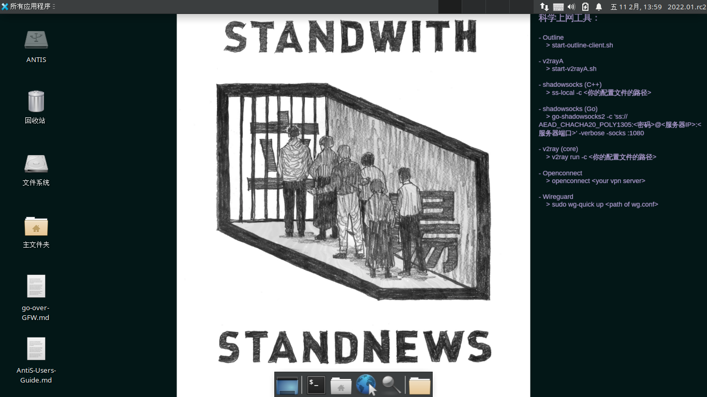

# antiS
**一款中文、粤语、藏语、维语友好，隐私加强的电脑操作系统（基于 Slackware Live，GNU/Linux 发行版）**

> 曾用名：LiveSlak，现改为 **antiS**：anti-Surveillance —— 对抗监控、审查、取证，捍卫自己的网络自由。  



主要集成功能：  
  - 中文化（80%） 粤语（80%） 藏语（50%） 维语（60%）
  - 隐私加强
    - 预装隐私保护类和信息/通讯自由相关的应用
	- live 性质，重启后系统恢复初始状态（不保存任何修改，不留下任何痕跡）
    - 系统加固（包括：防火墙、用户和进程权限控制、文件系统权限和挂载限制、内核参数配置调优等……）
	- 应用加固（firejail 沙盒、火狐浏览器加固等）

更新日期：2022.07.10  

發佈頻道：	 
- Mastodon:
	- https://fosstodon.org/@mdrights (英文)
- Matrix：#antis:envs.net  
- IRC: #aqi-data-share (@OFTC)  


## Download

- 下载地址 
	- https://sourceforge.net/projects/liveslak-atgfw/files/iso/
	- Version: **2022.03** (= 3047489536 Bytes)   
	- md5sum: 6da298d3ef68152138e33daa062e3e80  

[](https://sourceforge.net/projects/liveslak-atgfw/files/latest/download)


## Important Updates   

- 內核及基礎組件的更新；
- 重新 enable 了網卡的mac地址的隨機化（每次啓動後、建立連接後，網卡mac地址都不同，防止被追蹤）
- 新增：
  - oletools：可查找 Office 文檔中的 VBA/macro 等（惡意）代碼；
  - heif-convertor：蘋果系統圖片 HEIC 格式轉換器；
  - dwm+dmenu+st 窗口管理器（取代 icewm）；
- 注：新的內核似乎對 Macbook Air 的無線網卡不再支持（即使是閉源驅動也已逐漸難以支持最新的內核），因此暫時去掉 broadcom-sta 驅動。建議 Macbook 用戶自帶USB無線網卡，親測 EDUP, TP-LINK, RALINK 等多個型號可以免驅動直接使用）  

**注：过往更新记录见：[Changelog](https://github.com/mdrights/LiveSlak/blob/mdrights/Changelog.md)**
<hr>


## Usage

- 了解本发行版的具体特性，请阅读：    
	- [基本介绍](https://mdrights.github.io/os-observe/Liveslak-intro/)  
	- [使用手册](https://github.com/mdrights/LiveSlak/blob/mdrights/skel/Desktop/AntiS-Users-Guide.md)  
    - [科学上网指南](https://github.com/mdrights/LiveSlak/blob/mdrights/skel/Desktop/go-over-GFW.md)
	- [预装软件列表](https://github.com/mdrights/LiveSlak/blob/mdrights/pkglists/mdrights-xfce.lst)  
	- 溫馨提示：本系統雖然有一定匿名特性，但不主打匿名，請有高匿名需求的朋友使用：[Tails](https://tails.boum.org/about/index.en.html)  

- 版本命名规则：`<year>.<x>.<y>`  以当年年份为大版本，x 更新表示全系统的包都有更新，y 表示只有部分包更新 和/或 bug 修复，y 为 `rc` 时表示为预发行版。  


## Installation

- 将 iso 文件烧录到 USB 盘：   
0. 插入 USB 盤後，找出你的 U 盤是什麼編號：   
	- 在 Linux：   
	```
		$ lsblk  
		 (如果你的系統自動掛載了，需要卸載它——圖形界面的直接點「彈出」即可)
	```  
	- 在 macOS：  
	```
		$ diskutil list   (查看)    
		$ diskutil unmountDisk /dev/diskX   (系統會默認掛載，我們卸載它)
	```  
	- 在 Windows：
		- 下载烧录工具并根据软件的提示即可（比如开源的 [rufus](https://rufus.ie)）  

1. 用 `dd` 命令烧录；
	```
    （在 Linux ）
	sudo dd bs=4M if=/path/to/antis-xxxx.xx.iso of=/dev/XXX    (注意請看清你的 USB 盤是什麼編號喲)

    （在 macOS ）
	sudo dd bs=4m if=/path/to/antis-xxxx.xx.iso of=/dev/XXX    (注意請看清你的 USB 盤是什麼編號喲)
	```  
~~（暂废弃）方法2：使用本 repo 内的 `iso2usb.sh` 脚本安装~~  
	```
	bash iso2usb.sh -i /home/antis-xxxx.xx.iso -o /dev/sdb -c 25G -w 10
	```

- 在插入電腦開機時設置 BIOS，讓 USB 盤優先引導。
	- 不同電腦 BIOS 不同，怎麼進入 BIOS 可參考下表：
	
	| Manufacturer | Key                |
	|--------------|--------------------|
	| Acer         | Esc, F12, F9       |
	| Asus         | Esc, F8            |
	| Clevo        | F7                 |
	| Dell         | F12                |
	| Fujitsu      | F12, Esc           |
	| HP           | F9, Esc            |
	| Lenovo       | F12, Novo, F8, F10 |
	| Samsung      | Esc, F12, F2       |
	| Sony         | F11, Esc, F10      |
	| Toshiba      | F12                |
	| others…      | F12, Esc           |

- 找到`Boot Order` 這樣的選項，讓類似 `USB` 或你的 U 盤品牌的名字排到最前。然后按 F10 保存并退出就可进入 antiS 了。 

- 如果想利用好 USB 盘上的多余空间，可以创建一个分区，保存一些文件等等。方法见[我的博客](https://mdrights.github.io/os-observe/posts/2022/02/make-use-of-space-antis-live-usb.html)。  


## Device Requirements

- 您的机器必须是 `x86_64` 位的 **Intel 或 AMD** CPU 处理器啦~  
    - **对 Apple mac 机器**： 自 2022.01.rc5 版本起会有限的支持：  
        - 完整支持 MacBook Air （2020年及以前发售的，Intel CPU 和显卡，Broadcom 无线网卡）；  
        - 部分支持 Intel CPU 的 MacBook Pro（不支持键盘/触控板/无线网卡——需自备外置的；不可调节屏幕亮度等）
        - 对所有 M1 CPU 的设备都未能支持。  
- 需要至少 2G 内存；
- 如果你在虚拟机里运行，请为其设置足够的内存，而虚拟机的宿主机至少要有 4G 物理内存。
- 经测试，有的电脑只有 (U)EFI（主板启动固件）, Slackware 的 bootloader (syslinux + grub2) 可能无法广泛地支持所有 UEFI。如果遇到机器无法识别本系统的U盘——这情况请选择传统 BIOS 或带 CSM 的 EFI的电脑使用，或者在虚拟机里使用（并请告诉我 Orz）。


## Build

**如果你也想自己制作 LiveSlak 系统**   

> 本部分已移至我的博客：[os-observe](https://mdrights.github.io/os-observe/posts/2022/02/how-to-build-antis.html)  


## Acknowledgement

> Forked from Alien Bob's powerful building script for Slackware Live. Credits to Alien !    
> 本套脚本 forked 自 [Alien Bob](http://www.slackware.com/%7Ealien/liveslak/), git://bear.alienbase.nl/liveslak.git
- 非常感謝 Aaron Nexus @Telegram 給予的測試;-) 

<hr>
构建脚本的详细介绍和使用方法请见 Alien的 [README.txt](https://github.com/mdrights/LiveSlak/blob/mdrights/README_alien.txt)   

**交流反饋**：這裏發issue，或 IRC: #aqi-data-share (OFTC); 或 Matrix：#antis:matrix.org   


<hr>
<br />
## LICENSE

> Copyright 2014 - 2017 Eric Hameleers, Eindhoven, NL 
> Copyright 2017 - 2022 MDrights (mdrights at tutanota dot de)  
> All rights reserved  

> 只要本版权声明和许可声明出现在所有版本的本软件中， 本软件即可被允许以任何目的（有偿或无偿地）使用、复制、修改和分发。  

>
   Permission to use, copy, modify, and distribute this software for
   any purpose with or without fee is hereby granted, provided that
   the above copyright notice and this permission notice appear in all
   copies.
>
   THIS SOFTWARE IS PROVIDED ``AS IS'' AND ANY EXPRESSED OR IMPLIED
   WARRANTIES, INCLUDING, BUT NOT LIMITED TO, THE IMPLIED WARRANTIES OF
   MERCHANTABILITY AND FITNESS FOR A PARTICULAR PURPOSE ARE DISCLAIMED.
   IN NO EVENT SHALL THE AUTHORS AND COPYRIGHT HOLDERS AND THEIR
   CONTRIBUTORS BE LIABLE FOR ANY DIRECT, INDIRECT, INCIDENTAL,
   SPECIAL, EXEMPLARY, OR CONSEQUENTIAL DAMAGES (INCLUDING, BUT NOT
   LIMITED TO, PROCUREMENT OF SUBSTITUTE GOODS OR SERVICES; LOSS OF
   USE, DATA, OR PROFITS; OR BUSINESS INTERRUPTION) HOWEVER CAUSED AND
   ON ANY THEORY OF LIABILITY, WHETHER IN CONTRACT, STRICT LIABILITY,
   OR TORT (INCLUDING NEGLIGENCE OR OTHERWISE) ARISING IN ANY WAY OUT
   OF THE USE OF THIS SOFTWARE, EVEN IF ADVISED OF THE POSSIBILITY OF
   SUCH DAMAGE.


